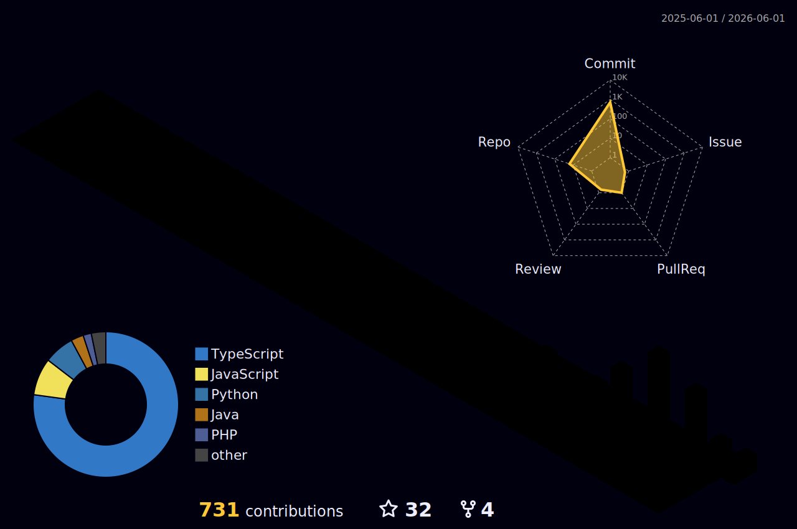

  
  # ✨ Welcome to Duong's Cyber Space ✨

  

  
<i>"Designing intelligent systems and exploring the depths of cybersecurity."</i>

  

---

### 🚀 About My Journey

- 🎓 **Education:** Studying Software Engineering at **FPT University** & Advanced Diploma at **Aptech Việt Nam**.
- 🔭 **Current Focus:** **Artificial Intelligence, Multi-Agent Systems**, and **Local LLM Deployment**.
- 🛡️ **Cybersecurity:** Researching dynamic behavior analysis and automated malware sandboxes.
- ⚙️ **Active Projects:** Building **LIVA**, a personal AI assistant focused on self-evolution, and developing dynamic systems.
- 🏆 **Collaborations:** Proud member of **Team FPUS**, actively building solutions for tech arenas like DENSO Factory Hacks and hackathons.

### 💻 Tech Stack & Tools

  
  
  
  
  
  
  
  

---

### 📊 Performance Metrics

  
  

 

  

---

### 🏙️ My GitHub City

  

---

### 🤝 Let's Connect!

  
  
  
  

