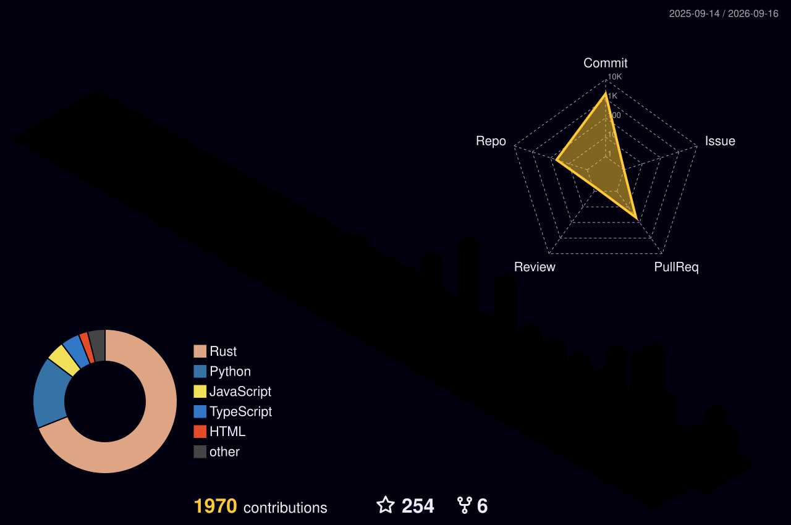

<!-- ═══════════════════════════════ HEADER ═══════════════════════════════ -->

  

  

    

  

  
<i>"Designing intelligent systems and exploring the depths of cybersecurity."</i>

<!-- ═══════════════════════════════ ABOUT ═══════════════════════════════ -->

## 🚀 About My Journey

- 🎓 **Education:** Studying Software Engineering at **FPT University** & Advanced Diploma at **Aptech Hà Nội**.
- 🔭 **Current Focus:** **Artificial Intelligence, Multi-Agent Systems**, and **Local LLM Deployment**.
- 🛡️ **Cybersecurity:** Researching dynamic behavior analysis and automated malware sandboxes.
- ⚙️ **Active Projects:** Building **LIVA**, a personal AI assistant focused on self-evolution, and developing dynamic systems.
- 🏆 **Collaborations:** Proud member of **Team FPUS**, actively building solutions for tech arenas like DENSO Factory Hacks and hackathons.
- 💬 **Ask me about:** AI Agents, LLM orchestration, malware analysis, and system design.

---

<!-- ═══════════════════════════════ FEATURED PROJECTS ═══════════════════════════════ -->

## ⭐ Featured Projects

  
  
  

<table align="center">
  <tr>
    <td width="33%" valign="top">

**🧬 LIVA**

*Self-Evolving Personal AI Assistant*

A personal AI designed to **learn, adapt, and evolve** — exploring agentic architectures and self-improvement loops to grow beyond a static assistant.

`AI Agents` · `LLM` · `Self-Evolution`

    </td>
    <td width="33%" valign="top">

**🌱 Anima-Engine**

*Artificial Life & Evolution Simulator*

A **real-time, GPU-accelerated** simulator for artificial life — modeling emergent behavior and evolution at scale in the browser.

`TypeScript` · `WebGPU` · `Simulation`

    </td>
    <td width="33%" valign="top">

**📈 Datathon 2026**

*The Gridbreakers — Revenue Forecasting*

**LightGBM** revenue forecasting (**R² = 0.80**) with full **EDA** and **SHAP** explainability — Round 1 competition submission.

`Python` · `LightGBM` · `SHAP`

    </td>
  </tr>
</table>

---

<!-- ═══════════════════════════════ TECH STACK ═══════════════════════════════ -->

## 💻 Tech Stack & Tools

<table align="center">
  <tr>
    <td align="center"><b>Languages</b></td>
    <td>
      
    </td>
  </tr>
  <tr>
    <td align="center"><b>Frameworks</b></td>
    <td>
      
    </td>
  </tr>
  <tr>
    <td align="center"><b>Tools & OS</b></td>
    <td>
      
    </td>
  </tr>
</table>

---

<!-- ═══════════════════════════════ STATS ═══════════════════════════════ -->

## 📊 Performance Metrics

  
  

  

 

  

---

<!-- ═══════════════════════════════ TROPHIES ═══════════════════════════════ -->

## 🏆 GitHub Trophies

  

---

<!-- ═══════════════════════════════ 3D CITY ═══════════════════════════════ -->

## 🏙️ My GitHub City

  

---

<!-- ═══════════════════════════════ CONNECT ═══════════════════════════════ -->

## 🤝 Let's Connect!

  

