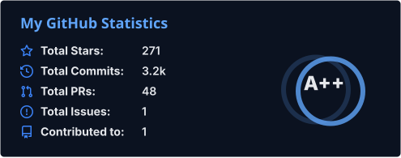
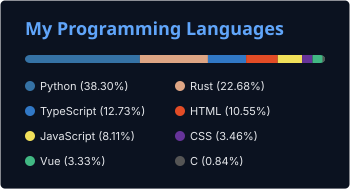
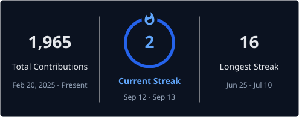
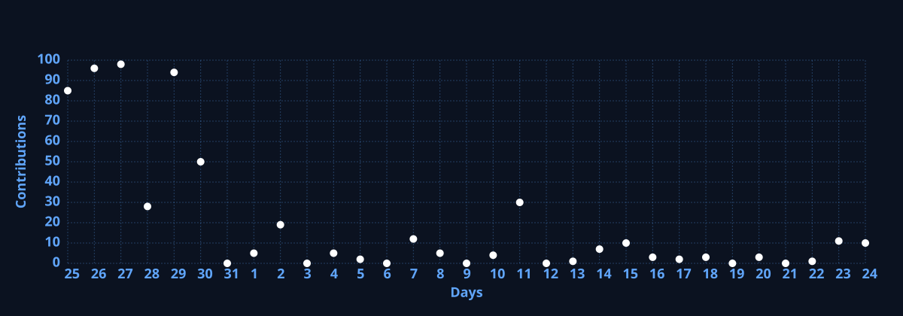
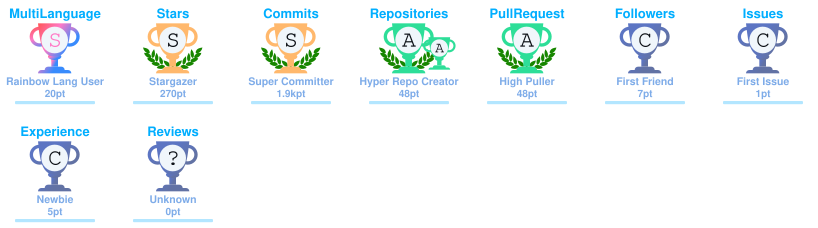

<!-- ═══════════════════════════════ HEADER ═══════════════════════════════ -->

  

  
  &nbsp;
  
  &nbsp;
  

    

  

  
<i>"Turning data and machine learning into scalable, user-centered products."</i>

<!-- ═══════════════════════════════ ABOUT ═══════════════════════════════ -->

## About

Software Engineering student building **AI/ML-powered products** and data-driven systems with **Python**, **TypeScript**, **SQL**, and **Rust**. Team Lead of **MindSync** at the **Vietnam AI Innovation Challenge 2026**, owning architecture and delivery of a deployable public-service AI assistant.

I ship end-to-end work across **agentic AI**, **local LLM inference**, **reinforcement learning**, **evolutionary computation**, **computer vision**, and **statistical experimentation** — with a hard bias toward reproducibility, model evaluation, and measurable outcomes.

- Education: **FPT University** (Software Engineering) & **APTECH** (ADSE Diploma)
- Now: Agentic systems, local LLMs, scientific simulation, and grounded public-service AI
- Ask me about: MCP agents, RAG / vector search, deterministic simulation, and shipping under a 48-hour deadline
- Based in **Hanoi, Vietnam**

---

<!-- ═══════════════════════════════ FEATURED PROJECTS ═══════════════════════════════ -->

## Featured Projects

<!-- GFM treats 4-space indent after a blank line as a code block. Keep table tags flush-left. -->
<table>
<tr>
<td width="50%" valign="top">
<h3><a href="https://github.com/DuongNAD/LIVA">LIVA</a> — Agentic AI Assistant</h3>

<code>TypeScript</code> <code>Python</code> <code>Rust</code> <code>Tauri</code> <code>Llama.cpp</code>

Personal cognitive assistant with a <strong>5-tier memory system</strong> — from working context to a persistent knowledge graph — and <strong>SQLite-Vec</strong> retrieval for long-running workflows.

Unifies native Python/C++ inference, a Node.js gateway, and a Tauri/Rust desktop UI. <strong>91 MCP tools</strong> for OS control, browser RPA, web intelligence, and autonomous engineering loops.

</td>
<td width="50%" valign="top">
<h3><a href="https://github.com/DuongNAD/Anima-Engine">Anima Engine</a> — Artificial Life</h3>

<code>Rust</code> <code>Bevy ECS</code> <code>Burn</code> <code>Tauri v2</code> <code>React</code> <code>Three.js</code>

Deterministic artificial-life engine: procedural terrain, hydrology, climate and soil fields, closed energy flows, predator–prey ecology, and <strong>MAP-Elites</strong> evolution.

Reproducibility via versioned world artifacts, seeded RNG, and zero-allocation Rust tick paths. The living world is rendered in <strong>React</strong>, <strong>PixiJS</strong>, and <strong>Three.js</strong>.

</td>
</tr>
<tr>
<td width="50%" valign="top">
<h3><a href="https://github.com/DuongNAD/Darwin-core">Darwin Lab</a> — Natural Selection Sandbox</h3>

<code>TypeScript</code> <code>Next.js</code> <code>Web Workers</code> <code>MCP</code> <code>Statistics</code>

Research-grade browser lab for natural selection: <strong>7 trade-off genes</strong>, <strong>8 environmental scenarios</strong>, seeded replay, A/B controls, and repeatable multi-run experiments.

Ships <strong>95% CIs</strong>, Welch tests, intervention audit trails, regression / golden-master coverage, and an MCP interface for agent-driven experimentation.

</td>
<td width="50%" valign="top">
<h3><a href="https://github.com/DuongNAD/VN_AI_Innovation">AI Public Service Assistant</a> — VAIC 2026</h3>

<code>Next.js 16</code> <code>Prisma</code> <code>PostgreSQL</code> <code>FPT AI</code> <code>Docker</code>

<strong>Team Lead · MindSync.</strong> Owned architecture, split the 48-hour national final into workstreams, and integrated one deployable product.

Grounded three-stage assistant: identify public procedures, generate legally sourced document checklists, collect dynamic form data, and block invalid submissions with deterministic rules. Vietnamese voice I/O, PDF forms, citizen–officer review, CI, Docker / Render / PostgreSQL.

</td>
</tr>
<tr>
<td colspan="2" valign="top">
<h3>Vision-Guided Robotic Arm — DENSO Factory Hacks 2025</h3>

<code>Python</code> <code>ROS</code> <code>Computer Vision</code> <code>Robotics</code>

6-DOF robotic arm with a perception-to-motion pipeline for autonomous package detection, pick-and-place, and factory sorting. Designed around industrial ROI (<strong>~30% productivity</strong>). <strong>Top 4</strong> and <strong>Promising Award</strong> from DENSO &amp; FPT — <a href="https://drive.google.com/file/d/1K1Sfw4AnxBfi7deHBIaIqpH9cJ-G3ti9/view">certificate</a>.

</td>
</tr>
</table>

---

<!-- ═══════════════════════════════ AWARDS ═══════════════════════════════ -->

## Awards & Leadership

| Year | Role | Outcome |
| :--- | :--- | :--- |
| Jul 2026 | **Team Lead, MindSync** — Vietnam AI Innovation Challenge | Led the 48-hour national AI-native hackathon from a real public-service brief to a deployable full-stack prototype |
| Nov 2025 | **Team FPUS** — DENSO Factory Hacks | **Top 4** & **Promising Award** (DENSO × FPT) for the vision-guided robotic arm |
| 2026 – Present | **JS Club**, FPT University | Technical workshops, peer programming, and Codefest |

**Certifications:** [VAIC 2026 Online Bootcamp](https://drive.google.com/file/d/1x8zT32FnxJ5GZxvohfV4F_Ey9QUNAUzZ/view) (AI For Vietnam) · [Gemini Academy for Student](https://drive.google.com/drive/folders/1ReTN1dchOAJMWSwM_gW633iAOhdysV1H) (Google)

---

<!-- ═══════════════════════════════ TECH STACK ═══════════════════════════════ -->

## Tech Stack

<table>
<tr>
<td align="center" width="22%"><b>Languages</b></td>
<td>

</td>
</tr>
<tr>
<td align="center"><b>Frameworks</b></td>
<td>

</td>
</tr>
<tr>
<td align="center"><b>Data &amp; Infra</b></td>
<td>

</td>
</tr>
</table>

 

  
  
  
  
  
  
  
  
  

---

<!-- ═══════════════════════════════ STATS ═══════════════════════════════ -->

## GitHub

  
  

  

 

  

---

<!-- ═══════════════════════════════ TROPHIES ═══════════════════════════════ -->

## Trophies

  

---

<!-- ═══════════════════════════════ 3D CITY ═══════════════════════════════ -->

## Contribution City

  

---

<!-- ═══════════════════════════════ CONNECT ═══════════════════════════════ -->

## Connect

  

