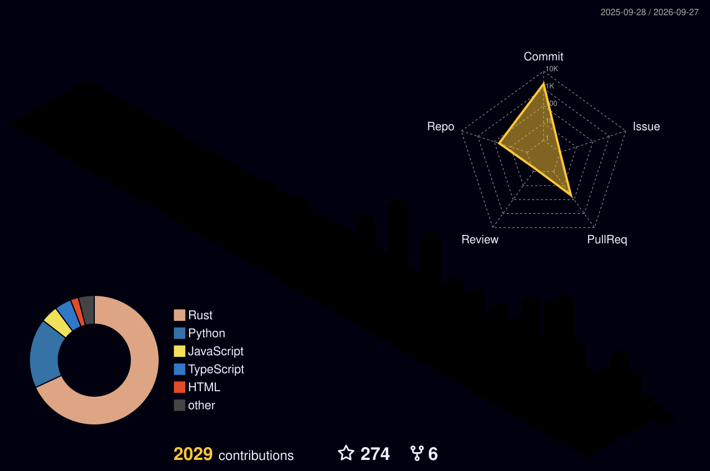
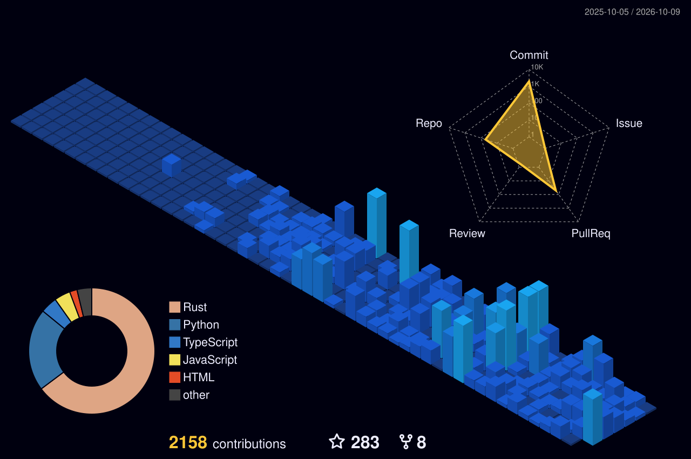
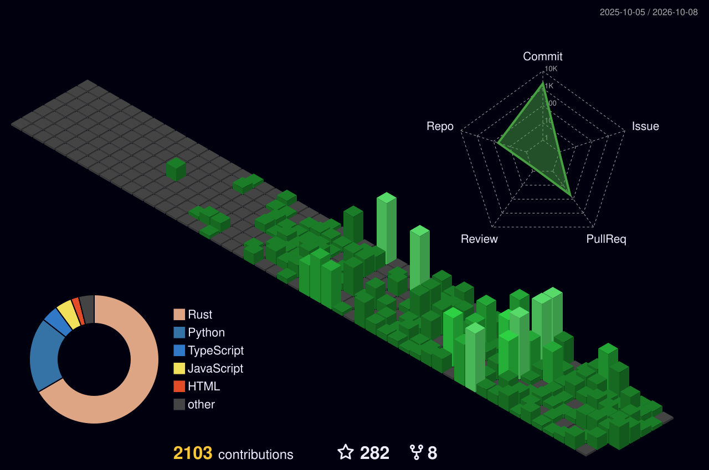
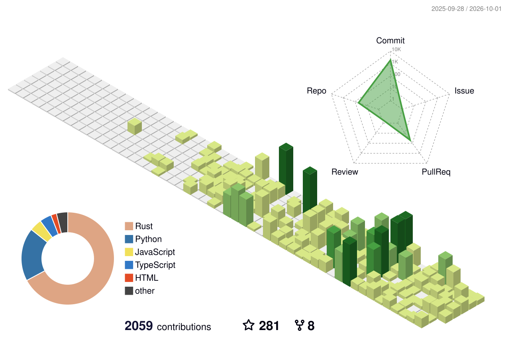
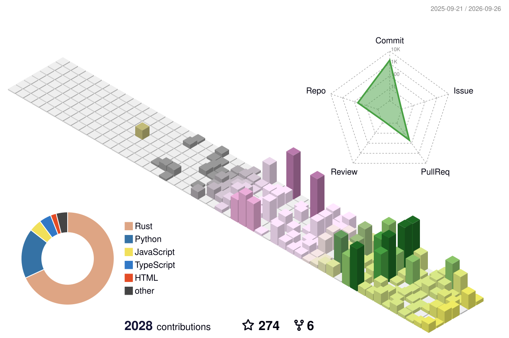

<!-- ═══════════════════════════════ HEADER ═══════════════════════════════ -->

  

  
  &nbsp;
  
  &nbsp;
  
  &nbsp;
  

    

  

  
<i>"Architecting autonomous cognitive systems, FastMCP ecosystems, and deterministic AI infrastructure for scalable, real-world impact."</i>

---

<!-- ═══════════════════════════════ ABOUT ═══════════════════════════════ -->

## ⚡ Executive Dossier

Software Engineering student at **FPT University** & **APTECH (ADSE)** specializing in **Generative AI, Autonomous Agentic Systems, and High-Performance Infrastructure**. Proven track record architecting production cognitive architectures (**LIVA** with 5-tier memory & **91 MCP tools**), real-time simulation engines (**Anima Engine** in Rust/Bevy), and deterministic constraint solvers (**Buy or Wait?**, Global Top 16% in HackerRank Orchestrate).

<table>
<tr>
<td width="33%" valign="top">
<h4>🧠 Agentic Architectures</h4>
<ul>
  <li>5-tier cognitive memory: working context, episodic, semantic, procedural & knowledge graphs.</li>
  <li>FastMCP tool server design with sandboxed execution, JSON-RPC, and self-healing error recovery.</li>
  <li>Autonomous multi-agent orchestration with function calling & strict structured schema enforcement.</li>
</ul>
</td>
<td width="33%" valign="top">
<h4>🦀 Systems & Performance</h4>
<ul>
  <li>Zero-allocation Rust tick paths and deterministic state machines for complex environments.</li>
  <li>Bevy ECS & GPU compute (Burn / PyTorch, CUDA, WGPU, Three.js) for evolutionary simulations.</li>
  <li>Local LLM inference optimization via Llama.cpp (C++/Python bindings) & ONNX Runtime.</li>
</ul>
</td>
<td width="33%" valign="top">
<h4>🛡️ Grounded Determinism</h4>
<ul>
  <li>Statutory document extraction and statutory verification pipelines eliminating hallucinations.</li>
  <li>Deterministic constraint solvers for multi-horizon cashflow and reserve guarantee verification.</li>
  <li>Automated AI judge suites & continuous evaluation harnesses for multi-turn agent benchmarks.</li>
</ul>
</td>
</tr>
</table>

- 🎓 **Education**: **FPT University** (Software Engineering) · **APTECH Computer Education** (ADSE Diploma)
- 📍 **Base of Operations**: Hanoi, Vietnam
- 🚀 **Core Specialty**: Autonomous Multi-Agent Systems, FastMCP Servers, Local LLM Runtimes, High-Performance Rust & Python

---

<!-- ═══════════════════════════════ FEATURED PROJECTS ═══════════════════════════════ -->

## 🚀 Flagship Engineering Projects

<table>
<tr>
<td width="50%" valign="top">

### 🧠 [LIVA — Advanced Agentic AI Assistant](https://github.com/DuongNAD/LIVA)

  <a href="https://github.com/DuongNAD/LIVA">
    
  </a>

- **Cognitive Architecture**: 5-tier memory engine spanning active working context, episodic traces, semantic embeddings, procedural rules, and SQLite-Vec knowledge graph retrieval.
- **Agentic Runtime**: Unifies native C++/Python inference (**Llama.cpp**), a Node.js gateway, and a high-performance **Tauri/Rust** desktop shell.
- **Ecosystem**: Armed with **91 MCP tools** executing desktop automation, browser RPA, file operations, and background agent loops.
- `TypeScript` `Python` `Rust` `FastAPI` `Tauri` `Llama.cpp` `SQLite-Vec`

</td>
<td width="50%" valign="top">

### 💾 [SmartDrive-OS — AI-Ready Storage Optimizer](https://github.com/DuongNAD/smart-drive-os)

  <a href="https://github.com/DuongNAD/smart-drive-os">
    
  </a>

- **Storage Optimization**: Zero-dependency secondary storage architecture framework hardened against exFAT cluster slack and duplicate fragmentation.
- **Fast Search Engine**: Integrated **SQLite FTS5** full-text search indexing millions of files with millisecond retrieval latency.
- **MCP Tool Integration**: Ships 8 custom FastMCP tools empowering AI coding agents to search, organize, and profile massive drives securely.
- `Python` `SQLite FTS5` `FastMCP` `Storage Optimization` `Cluster Slack`

</td>
</tr>
<tr>
<td width="50%" valign="top">

### 📈 [Buy or Wait? — AI Financial Reasoning Agent](https://drive.google.com/file/d/1Hl0qvEHIbgp6Fus2o0EukKZImMNrEr-I/view)

  <a href="https://drive.google.com/file/d/1Hl0qvEHIbgp6Fus2o0EukKZImMNrEr-I/view" target="_blank">
    
  </a>

- **Autonomous Cashflow Solvers**: Evaluates multimodal purchase inquiries, receipt line items, and liabilities against dynamic multi-horizon cashflow constraints.
- **Deterministic Solvers**: Formulated deterministic optimization algorithms enforcing mandatory reserve buffer thresholds across unpredictable cash flows.
- **HackerRank Orchestrate 2026**: Verified by AI judge evaluation suites across multi-turn reasoning scenarios; earned **Final Rank #493 / 3,062** globally.
- `Python` `Agentic AI` `Cashflow Optimization` `Constraint Programming` · [Verified Certificate](https://drive.google.com/file/d/1Hl0qvEHIbgp6Fus2o0EukKZImMNrEr-I/view)

</td>
<td width="50%" valign="top">

### 🏛️ [AI Public Service Assistant — VAIC 2026](https://github.com/DuongNAD/VN_AI_Innovation)

  <a href="https://github.com/DuongNAD/VN_AI_Innovation">
    
  </a>

- **Hackathon Leadership**: **Team Lead of MindSync** at the Vietnam AI Innovation Challenge (VAIC 2026); delivered a production-ready assistant in a 48-hour sprint.
- **Grounded Legal RAG**: High-precision statutory document extraction and legal verification pipeline with deterministic rule checks to eradicate hallucinations.
- **Citizen Portal**: Features Vietnamese voice I/O, automated PDF administrative form generation, and dual-review portals containerized via Docker.
- `Next.js 16` `FastAPI` `Prisma` `PostgreSQL` `FPT AI` `Docker`

</td>
</tr>
<tr>
<td width="50%" valign="top">

### 🧬 [Anima Engine — GPU Artificial Life Simulator](https://github.com/DuongNAD/Anima-Engine)

  <a href="https://github.com/DuongNAD/Anima-Engine">
    
  </a>

- **Deterministic Ecosystem**: Real-time artificial life simulation featuring procedural terrain, hydrology/climate modeling, and closed-loop energy thermodynamics.
- **Evolutionary Computing**: Powered by **MAP-Elites** illumination algorithms evolving behavioral repertoires of neural agents across generations.
- **High-Performance Architecture**: Zero-allocation Rust tick paths, seeded RNG reproducibility, versioned world artifacts, rendered via Three.js and PixiJS.
- `Rust` `Bevy ECS` `Burn / PyTorch` `Tauri v2` `React` `Three.js`

</td>
<td width="50%" valign="top">

### 🛠️ [FastMCP Ecosystem & Autonomous Workers](https://github.com/DuongNAD/mcp-agy)

  <a href="https://github.com/DuongNAD/mcp-agy">
    
  </a>

- **Autonomous Agent Workers**: [mcp-agy](https://github.com/DuongNAD/mcp-agy) turns Google Antigravity into an autonomous background coding worker for Claude Code, Cursor, and Cline.
- **Meeting Intelligence**: [google-meet-mcp](https://github.com/DuongNAD/google-meet-mcp) connects LLMs to real-time meeting transcription and intelligence pipelines.
- **Standardized Execution**: Implements JSON-RPC 2.0 specs, isolated subprocess workers, and self-healing recovery routines for uninterrupted agent loops.
- `Python` `FastMCP` `JSON-RPC` `Subprocess Sandboxing` `LLM Tool Calling`

</td>
</tr>
</table>

---

<!-- ═══════════════════════════════ COMPETITIONS & HONORS ═══════════════════════════════ -->

## 🏆 Honors, Competitions & Certifications

| Date | Competition / Initiative | Role & Result | Core Achievement |
| :--- | :--- | :--- | :--- |
| **Sep 2026** | **HackerRank Orchestrate** | **Top 16% Globally** (Rank #493 / 3,062) | Deployed *"Buy or Wait?"*, an autonomous financial reasoning agent solving multi-horizon cashflow constraints evaluated by automated AI judges · [Verified Certificate](https://drive.google.com/file/d/1Hl0qvEHIbgp6Fus2o0EukKZImMNrEr-I/view) |
| **Jul 2026** | **Vietnam AI Innovation Challenge** | **Team Lead** (MindSync) | Orchestrated national 48-hour AI hackathon team, shipping a deployable public administrative assistant with grounded statutory RAG and voice I/O · [Source](https://github.com/DuongNAD/VN_AI_Innovation) |
| **Nov 2025** | **DENSO Factory Hacks** | **Top 4 & Promising Award** (Team FPUS) | Engineered a 6-DOF vision-guided robotic arm with ROS and OpenCV for autonomous parcel pick-and-place with projected 30% productivity gain · [Verified Certificate](https://drive.google.com/file/d/1K1Sfw4AnxBfi7deHBIaIqpH9cJ-G3ti9/view) |
| **2026 – Present** | **JS Club — FPT University** | Active Member | Technical workshops, algorithmic problem solving, peer programming, and Codefest initiatives |

  
  &nbsp;
  [-2563EB?style=flat-square&logo=target&logoColor=white)](https://drive.google.com/file/d/1x8zT32FnxJ5GZxvohfV4F_Ey9QUNAUzZ/view)
  &nbsp;
  
  &nbsp;
  [-4285F4?style=flat-square&logo=google&logoColor=white)](https://drive.google.com/drive/folders/1ReTN1dchOAJMWSwM_gW633iAOhdysV1H)

---

<!-- ═══════════════════════════════ TECH ARSENAL ═══════════════════════════════ -->

## 🛠️ Technical Arsenal & Skills Matrix

<table>
<tr>
<td align="center" width="22%"><b>Languages</b></td>
<td>
  
</td>
</tr>
<tr>
<td align="center"><b>AI &amp; Cognitive</b></td>
<td>
  
  &nbsp;
  
  
  
  
  
</td>
</tr>
<tr>
<td align="center"><b>Fullstack &amp; UI</b></td>
<td>
  
  &nbsp;
  
  
  
</td>
</tr>
<tr>
<td align="center"><b>Infra, DB &amp; Tooling</b></td>
<td>
  
  &nbsp;
  
  
</td>
</tr>
</table>

---

<!-- ═══════════════════════════════ LIVE TELEMETRY & STATS ═══════════════════════════════ -->

## 📊 Live Telemetry & GitHub Analytics

  ### 🐍 Contribution Activity Stream
  <picture>
    <source media="(prefers-color-scheme: dark)" srcset="./assets/github-contribution-grid-snake-dark.svg">
    <source media="(prefers-color-scheme: light)" srcset="./assets/github-contribution-grid-snake.svg">
    
  </picture>

    

  ### ⚡ Productivity & Language Distribution
  

    
    &nbsp;&nbsp;
    
  

   

  ### 🔥 Continuous Commitment Streak
  

    

  ### 📈 Dynamic Activity Curve
  

    

  ### 🏆 Algorithmic Achievements
  

---

<!-- ═══════════════════════════════ 3D ISOMETRIC CITY ═══════════════════════════════ -->

## 🏙️ 3D Contribution Metropolis

  

<b>🌐 Explore Alternate Isometric City Views (Click to Expand)</b>

 

| View Mode | Isometric Visualization |
| :---: | :---: |
| **Night View** |  |
| **Night Green** |  |
| **Green Animate** |  |
| **Seasonal View** |  |

---

<!-- ═══════════════════════════════ CONNECT ═══════════════════════════════ -->

## 🌐 Connect & Collaborate

&nbsp;

&nbsp;

&nbsp;

&nbsp;

&nbsp;

  

